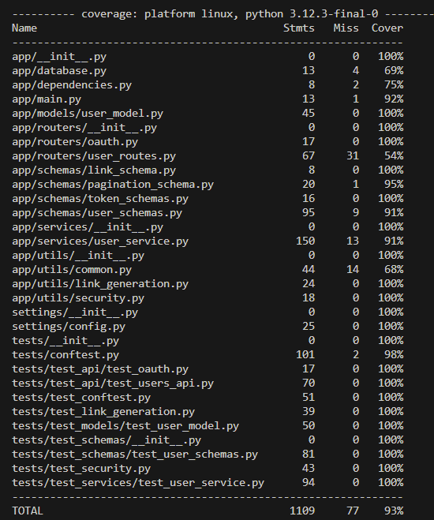

<h1>Links to issues</h1>
<a href="https://github.com/gbj3/hw10-219/issues/6">Issue 1</a>
<a href="https://github.com/gbj3/hw10-219/issues/7">Issue 2</a>
<a href="https://github.com/gbj3/hw10-219/issues/8">Issue 3</a>
<a href="https://github.com/gbj3/hw10-219/issues/9">Issue 4</a>
<a href="https://github.com/gbj3/hw10-219/issues/10">Issue 5</a>

<h1>Image on DockerHub</h1>

<h1>Image on Coverage</h1>

<h1>Reflection</h1>

This assignement did a solid job in being thrown into a larger developed project, similar to what would be in industry. Having 
to navigate through the program and identify what each piece plays in a larger puzzle was a testiment to my understanding. With every file 
I navigated through, the picture became clearer as I saw how everything came together. This became natural as I spent more time with the project.
  
The tracking of my features via GitHub was valuable as it made for documentation to be natural and clean. I was better able to navigate through 
my work and see where I went wrong in the process. Further, it will allow for anyone who comes across my work to have an idea of my though process 
as I worked. This is especially important in a collaborative environment as you will not always be there to explain what each piece of software is 
used for, but rather, the next engineer will need to simply be able to understand it on their own.
  
This class is my first experiene with Docker and the containerization of things. I am used to simply working on my machine, and when it works, 
I am done. The new element where my computer does not matter and I need it to work on the cloud introduces a new element of both frustration and 
understanding. Seeing as this is the way the industry works, it's pivotal that I understand it, and I am appreciative of this class for being the 
first step in that direction. Further, the testing involved in the assignment has expanded my knowledge in making sure it truly works before deployment.

