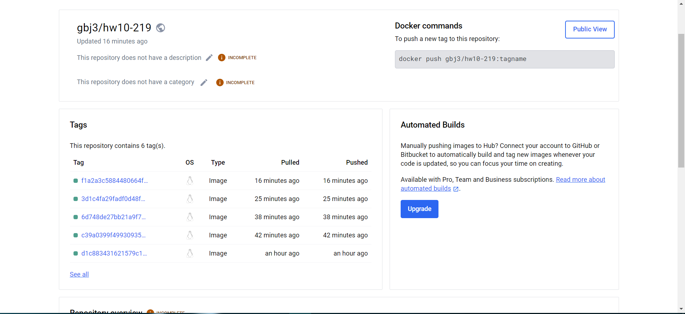

<h1>Links to issues</h1>
<a href="https://github.com/gbj3/hw10-219/issues/6">Issue 1</a>
<a href="https://github.com/gbj3/hw10-219/issues/7">Issue 2</a>
<a href="https://github.com/gbj3/hw10-219/issues/8">Issue 3</a>
<a href="https://github.com/gbj3/hw10-219/issues/9">Issue 4</a>
<a href="https://github.com/gbj3/hw10-219/issues/10">Issue 5</a>

<h1>Image on DockerHub</h1>

<h1>Reflection</h1>

